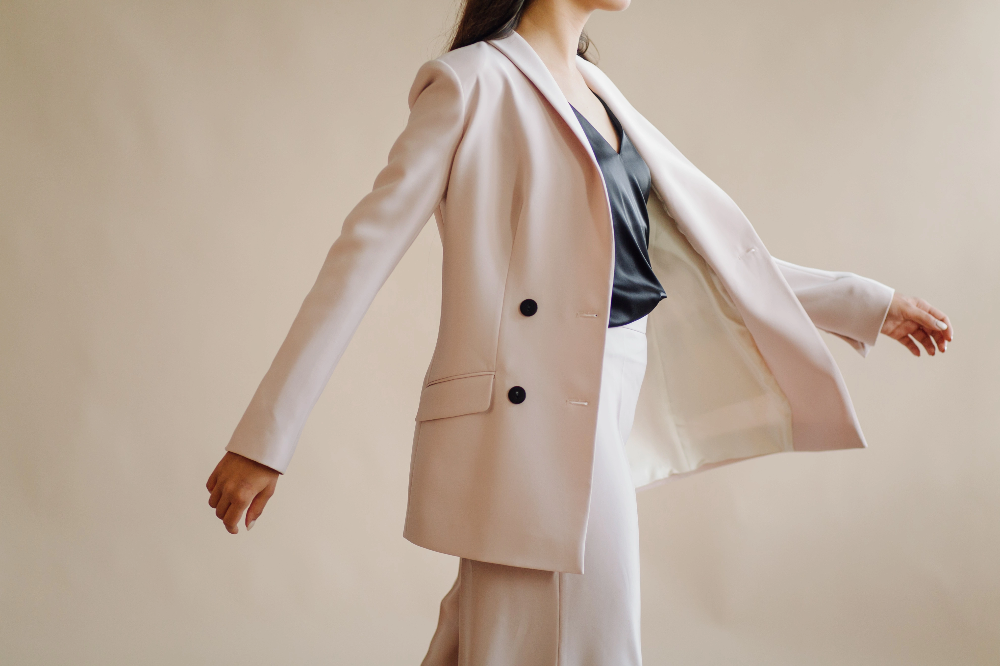
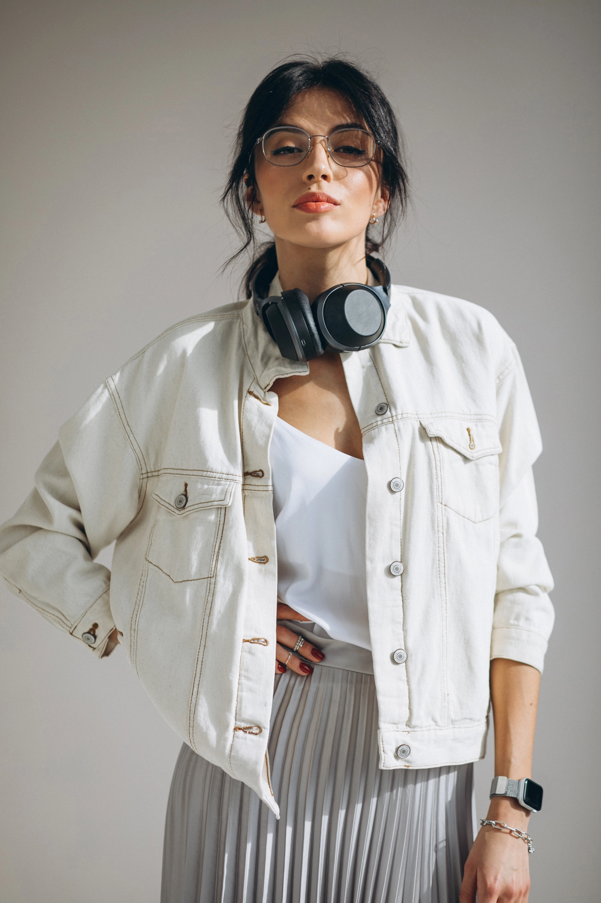

# maison élan

**Designing brands that stay.**

Identitas visual untuk bisnis yang ingin bertahan lama, bukan sekadar terlihat bagus minggu ini.

---

## Tentang

Kami adalah studio kecil yang percaya identitas visual bukan soal estetika — tapi soal kejujuran merek. Setiap garis, typeface, dan whitespace harus punya alasan. Tidak ada dekorasi tanpa makna, tidak ada tren tanpa tujuan.

25+ tahun berdiri · 97% kepuasan klien · 60+ koleksi rilis



---

## Portofolio


---

## Filosofi

Kami tidak mengikuti tren. Kami membangun fondasi.

Setiap proyek dimulai dengan pertanyaan sederhana: **untuk apa brand ini ada?** Jawabannya menjadi kompas untuk setiap keputusan desain — dari pemilihan typeface hingga ritme layout.

---

## Tech Stack

- **Vue 3** — Composition API, `<script setup>`, SFC
- **Vite** — build tool
- **animejs** — animasi ringan
- **Google Fonts** — Cormorant Garamond + DM Sans

---

## Memulai

```bash
npm install
npm run dev
```

---

© maison élan
